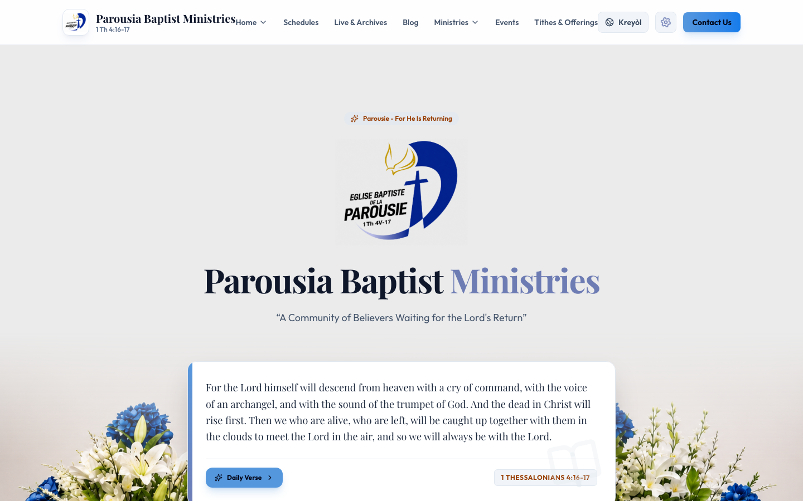
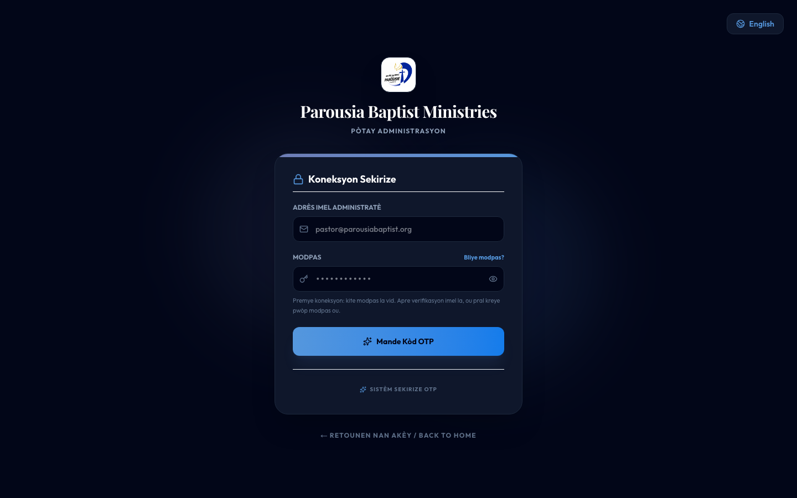
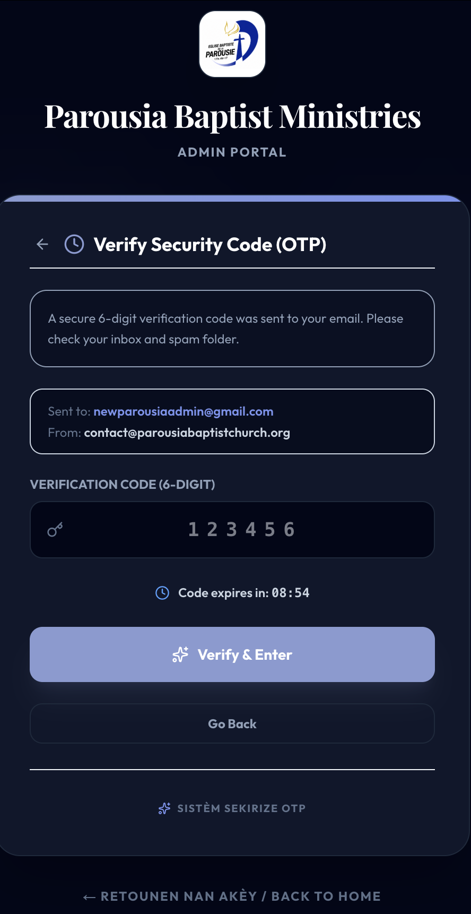
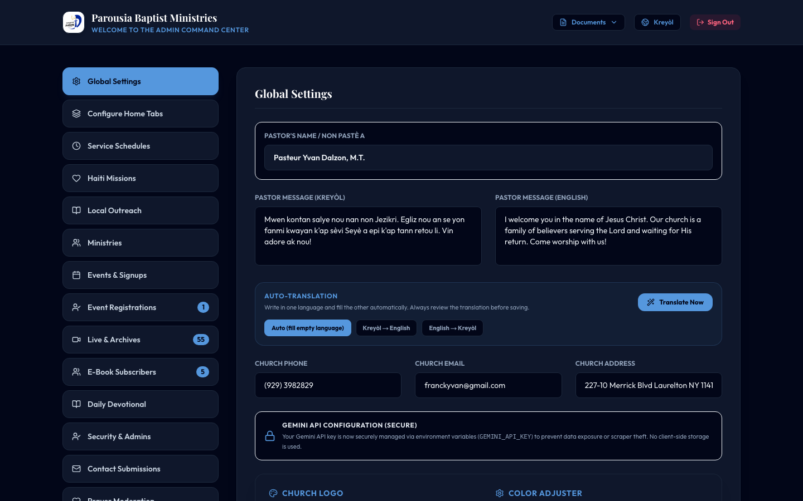
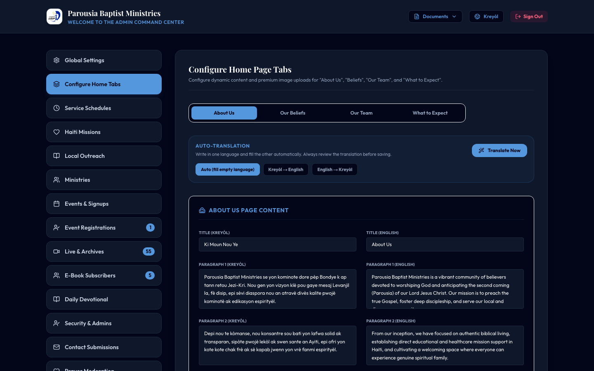
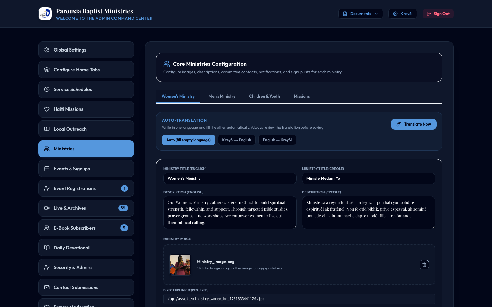
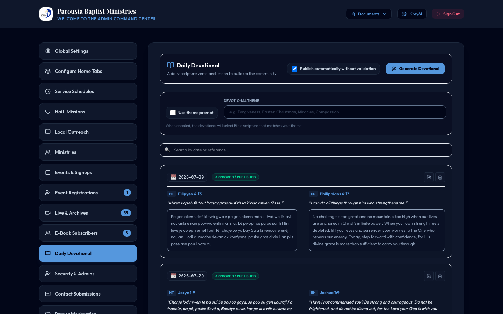
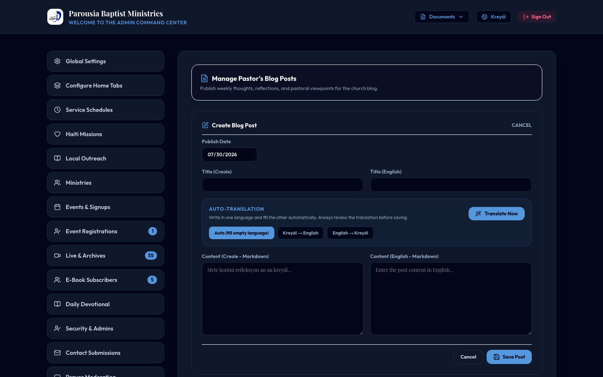
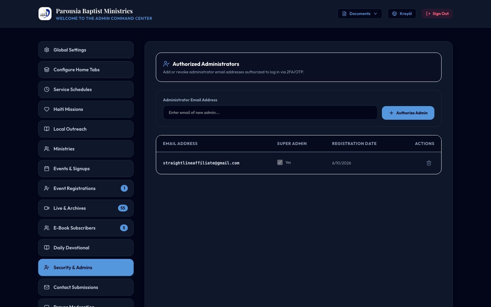

# Parousia Baptist Ministries
## Website Administration Guide

**Prepared for:** Pastor and Church Leadership  
**Prepared by:** Straight-Line Holdings, Inc.  
**Date:** July 29, 2026  
**Version:** 1.0

---

## Table of Contents

1. [Introduction](#1-introduction)
2. [Accessing the Admin Portal](#2-accessing-the-admin-portal)
3. [Logging In (Secure Two-Step Verification)](#3-logging-in-secure-two-step-verification)
4. [Admin Dashboard Overview](#4-admin-dashboard-overview)
5. [Global Settings](#5-global-settings)
6. [Configure Home Page Tabs](#6-configure-home-page-tabs)
7. [Service Schedules](#7-service-schedules)
8. [Haiti Missions & Local Outreach](#8-haiti-missions--local-outreach)
9. [Ministries (Women, Men, Children, Missions)](#9-ministries-women-men-children-missions)
10. [Events & Registrations](#10-events--registrations)
11. [Sermons & YouTube Sync](#11-sermons--youtube-sync)
12. [Daily Devotional & Theme Settings](#12-daily-devotional--theme-settings)
13. [Pastor's Blog](#13-pastors-blog)
14. [Contact Form Submissions](#14-contact-form-submissions)
15. [Prayer Wall Moderation](#15-prayer-wall-moderation)
16. [Managing Additional Administrators](#16-managing-additional-administrators)
17. [Language Toggle (French / English)](#17-language-toggle--bilingual-content-french--english)
18. [Creating a Site Backup](#18-creating-a-site-backup)
19. [Signing Out](#19-signing-out)
20. [Quick Reference & Support](#20-quick-reference--support)

---

## 1. Introduction

Welcome to the **Parousia Baptist Ministries** website administration guide. This document explains how to manage and update your church website without technical knowledge.

The website is designed to be used primarily in **French**, with a one-click switch to **English** for visitors and administrators.

**Your live website:**  
https://ParousiaBaptistChurch.org

**Admin login page:**  
https://ParousiaBaptistChurch.org/admin

---

## 2. Accessing the Admin Portal

There are three ways to reach the admin area:

**Option A — Direct URL**  
Type the admin URL above into your browser.

**Option B — Footer link (to log in)**
Before you are logged in, scroll to the bottom of the public website and click **Administration** under **Portals & Links**. This opens the admin login page.

**Option C — Gear icon (after you are logged in)**
After you log in, use the **gear (⚙) settings icon** on the main website to return to the admin portal. See the step-by-step instructions below.

### Moving between the Admin Portal and the Main Website

Use this workflow whenever you want to preview the public site while staying logged in as an administrator:

1. **Log in** to the Admin Portal (Option A or Option B above).
2. At the **top of the Admin page**, in the header bar on the right, click the **View Website** button (next to the language switcher).
3. The **main church website** opens. While you are still logged in, a **gear (⚙) icon** appears in the top navigation bar — between the **French** / **English** language button and the **Contact Us** button. (On mobile, the gear appears in the top bar as well.)
4. Browse the public site as needed. The gear icon is **only visible to logged-in administrators**; regular visitors do not see it.
5. When you are ready to make changes again, **click the gear icon**. This takes you **back to the Admin Portal** dashboard.

*Figure 1 — After you click **View Website**, the gear icon appears in the top navigation so you can return to the Admin Portal.*

**Important:** The gear icon does **not** appear until you have logged in and opened the main website (for example, by clicking **View Website**). If you sign out, the gear icon disappears — that is normal.

**Signing out**  
When you sign out of the admin portal, you are returned to the **main church website** if that is where you started (for example, after using **View Website**). If you opened the admin URL directly (bookmark or typed address), you remain on the admin login page after signing out.

---

## 3. Logging In (Secure Two-Step Verification)

Your admin portal uses secure login with email verification. This protects the church website from unauthorized changes.

### Step 1 — Enter Email and Password

1. Go to `/admin`
2. Enter your **authorized email address**
3. Enter your **personal access code (password)**
4. Click **Next** / **Kontinye**

*Figure 2 — Admin login Step 1.*

### Step 2 — Verify with Email Code (OTP)

On your **first login** or when signing in from a **new device**, the system sends a **6-digit verification code** to your email.

1. Check your inbox (and spam folder if needed)
2. Enter the 6-digit code within **10 minutes**
3. Click **Verify**

*Figure 3 — OTP verification screen (capture manually or with Playwright MCP).*

### Step 3 — Create or Reset Password (First-Time Users)

If this is your first login, you will be asked to **create a personal password**. Choose something secure and memorable. You will use this password on future logins (along with the email code when on a new device).

**Forgot password?**  
Click **Forgot Password** on the login screen, enter your email, verify with the code sent to your inbox, then set a new password.

---

## 4. Admin Dashboard Overview

After logging in, you arrive at the **Admin Command Center**. The left sidebar lists all management sections:

| Section | Purpose |
|--------|---------|
| **Global Settings** | Church info, logo, colors, hero image, contact details |
| **Configure Home Tabs** | About Us, Our Beliefs, Our Team, What to Expect |
| **Service Schedules** | Worship times and service descriptions |
| **Haiti Missions** | Haiti mission content |
| **Local Outreach** | Community outreach projects |
| **Ministries** | Women, Men, Children, and Missions ministry pages |
| **Events & Signups** | Church events and registration management |
| **Registrations** | View who signed up for events |
| **Sermons** | Manage sermon videos (YouTube sync) |
| **E-Book Subscribers** | Spiritual gift download signups |
| **Daily Devotional** | Daily verses, themes, and auto-publish |
| **Security & Admins** | Add/remove admin users *(Super Admin only)* |
| **Contact Submissions** | Messages from the Contact Us form |
| **Prayer Moderation** | Review and manage prayer requests |
| **Pastor's Blog** | Weekly pastor's point of view articles |

*Figure 4 — Admin dashboard overview.*

**Language toggle:**  
Use the **globe icon** in the top-right corner to switch the admin interface between French and English at any time.

---

## 5. Global Settings

**Menu:** Global Settings / *Anviwònman Global*

This is the most important section for overall site appearance and church information.

### Church Information

- **Pastor's Name** — displayed on the website
- **Pastor Message** — welcome message in both French and English
- **Church Phone, Email, and Address** — shown in the footer and contact areas

### Church Logo

- Click, drag-and-drop, or paste (Ctrl+V / Cmd+V) a new logo image
- Accepted formats: **PNG or JPG**
- After uploading, the system **automatically detects colors** from your logo and suggests a matching color palette

*Figure 5 — Logo upload panel.*

### Color Adjuster

- **Primary** — main button and accent color (light pastel blue is the current theme)
- **Hover** — color when users hover over buttons
- **Accent** — secondary highlight color
- **Background Theme** — switch between Light Mode and Dark Mode
- **Hero Background Opacity** — control how visible the background image is behind the hero section
- **Soften Text Backdrop** — adds a readable blur layer behind hero text

*Figure 6 — Color adjuster and live preview.*

### Hero Background Image

- Upload a custom background image for the home page hero section
- The floral artwork at the bottom of the hero is displayed from this image
- Adjust opacity using the slider above

### Devotional Theme (also in Daily Devotional tab)

- Enable **Use Theme** checkbox
- Enter a spiritual theme (e.g., *Faith*, *Hope*, *Forgiveness*, *Easter*)
- Leave theme disabled or blank for **random** daily verse selection

### Saving Changes

Always scroll to the bottom and click **Save Changes** / **Sove Chanjman yo** when finished. A success message will confirm your changes are live.

---

## 6. Configure Home Page Tabs

**Menu:** Configure Home Tabs / *Konfigire Paj Akèy*

This section controls the four sub-tabs under **Home** on the public website:

| Sub-Tab | Content |
|--------|---------|
| **About Us** | Church history and mission (French + English) |
| **Our Beliefs** | Statement of faith |
| **Our Team** | Pastor and Assistant Pastor profiles with photo, bio, and email |
| **What to Expect** | First-time visitor information |

For each sub-tab:

1. Click the sub-tab pill at the top (About Us, Beliefs, Team, Expect)
2. Fill in titles and body text in **both French and English**
3. Upload images by clicking, dragging, or pasting into the image zone
4. Click **Save**

*Figure 7 — Home page tab configuration.*

**Our Team tip:** Add a photo, name, role, short biography, and email for the Pastor and Assistant Pastor. These appear on the public "Our Team" page.

---

## 7. Service Schedules

**Menu:** Service Schedules / *Lè Sèvis yo*

Manage your weekly worship and service times.

- Click **+ Add** to create a new service entry
- Enter the day, time, service name, and description (French + English)
- Mark a service as **Live Stream** if it should appear in the live stream section
- Click the **pencil icon** to edit or the **trash icon** to delete

---

## 8. Haiti Missions & Local Outreach

**Haiti Missions** — Manage mission trip information, photos, and descriptions for your Haiti outreach work.

**Local Outreach** — Manage community outreach project listings (title, description, image, date).

Both sections follow the same pattern: add, edit, or delete entries, then save.

---

## 9. Ministries (Women, Men, Children, Missions)

**Menu:** Ministries

Configure the four ministry pages accessible from the **Ministries** tab on the public menu:

- **Women's Ministry**
- **Men's Ministry**
- **Children & Youth**
- **Missions**

For each ministry:

1. Select the ministry tab at the top
2. Enter title and description in French and English
3. Upload a ministry image
4. Add bullet points (one per line) in both languages
5. Set **committee contact** name, email, and phone
6. Add **notification emails** (comma-separated) to receive signup alerts
7. Click **Save Ministry**

**Viewing signups:**  
Below the form, a table shows individuals who signed up for that ministry. You can export signups to a spreadsheet using the export button.

*Figure 8 — Ministries configuration and signups.*

---

## 10. Events & Registrations

**Events & Signups** — Create church events (title, date, description, image). Visitors can register directly on the website.

**Registrations** — View all event signups. The badge number on the menu shows how many registrations are pending review.

To add an event:

1. Click **+ Add Event**
2. Fill in details in both languages
3. Save

---

## 11. Sermons & YouTube Sync

**Menu:** Sermons

- View all synced sermon videos from your YouTube channel
- Click **Sync from YouTube** to pull the latest videos automatically
- Edit sermon titles or delete entries as needed

---

## 12. Daily Devotional & Theme Settings

**Menu:** Daily Devotional / *Devosyonèl Chak Jou*

This section manages the daily Bible verse shown on the website.

### Theme Configuration

| Setting | Effect |
|--------|--------|
| **Use Theme — ON** + theme entered (e.g., "Hope") | Daily verse is selected around that spiritual theme |
| **Use Theme — OFF** or theme left blank | Daily verse is chosen **at random** |

Suggested themes: Forgiveness, Easter, Christmas, Miracles, Compassion, Faith, Love, Hope, Peace, Grace, Strength, Thanksgiving.

### Other Devotional Controls

- **Auto-Publish** — automatically publish approved devotionals each day
- **Generate** — use AI to create a new devotional draft (review before publishing)
- **Edit / Approve / Delete** — manage individual devotional entries in the list below

*Figure 9 — Daily devotional theme controls.*

---

## 13. Pastor's Blog

**Menu:** Pastor's Blog / *Piblikasyon Blòg*

Publish your weekly point of view articles (replaces the old "Community Outreach" public tab).

**To create a new blog post:**

1. Click **Create New Article**
2. Enter the title in English and French
3. Write the article content in both languages (Markdown formatting supported)
4. Set the publication date
5. Click **Save Article**

Use the **Translate** button to auto-translate content between languages (review before publishing).

*Figure 10 — Pastor's blog editor.*

---

## 14. Contact Form Submissions

**Menu:** Contact Submissions / *Mesaj Kontakte*

When visitors submit the **Contact Us** form on the public website, their messages appear here.

Each entry shows:

- Name
- Email
- Phone
- Message
- Date submitted

Review messages regularly and delete entries once handled.

---

## 15. Prayer Wall Moderation

**Menu:** Prayer Moderation / *Moderasyon Miray Lapriyè*

Visitors can submit prayer requests on the public Prayer Wall. Some may choose to remain **anonymous**.

| Column | Description |
|--------|-------------|
| **Requester** | Name (hidden from public if anonymous) |
| **Request Text** | The prayer request |
| **Anonymous?** | Yes/No — if Yes, name is not shown publicly |
| **Date** | When submitted |

Review new requests and delete spam or resolved entries. Approved requests appear on the public Prayer Wall with date, request text, and requester name (unless anonymous).

---

## 16. Managing Additional Administrators

**Menu:** Security & Admins / *Sekirite & Admins*  
**Access:** Super Admin only

To add a new administrator:

1. Enter their **email address** in the field
2. Click **Authorize Admin**
3. They will receive login instructions on first sign-in
4. On first login or from a new device, they must verify via **email code**

To remove an administrator, click the **trash icon** next to their email.

**Super Admin** checkbox grants full access including the ability to manage other admins.

*Figure 11 — Managing administrator accounts.*

---

## 17. Language Toggle & Bilingual Content (French / English)

The website and admin dashboard both support **French** and **English**.

### Visitor Language Toggle (Public Website)

- Click the **globe icon (🌐)** in the top-right corner of the public site
- Toggle between **French** and **English**
- This only changes how the site is displayed — it does not create content for you

### How Bilingual Content Works in Admin

Most admin sections show **two fields** for the same content:

- one field for **French**
- one field for **English**

Visitors will only see the correct language when both sides have been filled in (either manually or with auto-translation).

You have **two ways** to manage bilingual content:

#### Option A — Manual Entry (Traditional)

1. Type the French version in the left/French field
2. Type the English version in the right/English field
3. Click **Save**

Use this when you want full control over wording in both languages.

#### Option B — Auto-Translation (Recommended for Faster Updates)

Several admin sections now include an **Auto-Translation** panel with three choices:

| Mode | What It Does |
|------|----------------|
| **Auto (fill empty language)** | If you only filled in French, it translates to English. If you only filled in English, it translates to French. |
| **French → English** | Always uses the French text as the source and fills/overwrites the English fields |
| **English → French** | Always uses the English text as the source and fills/overwrites the French fields |

**Steps:**

1. Enter your content in **one language only** (or both, if you prefer)
2. Choose the translation direction
3. Click **Translate Now** / **Tradui Kounye a**
4. **Review the translated text carefully** before saving
5. Click **Save** to publish

> **Important:** Auto-translation uses AI and is very helpful, but it should always be reviewed by a human before publishing — especially for scripture references, church names, and pastoral language.

### Where Auto-Translation Is Available Today

| Admin Section | Auto-Translate Support |
|--------------|------------------------|
| **Global Settings** — Pastor Message | ✅ Yes |
| **Configure Home Tabs** — About, Beliefs, Team, What to Expect | ✅ Yes |
| **Ministries** — title, description, bullet points | ✅ Yes |
| **Pastor's Blog** | ✅ Yes |
| Service Schedules, Events, Missions, Outreach | Manual entry for now |

### Example Workflow (Pastor writes in French only)

1. Open **Configure Home Tabs** → **About Us**
2. Fill in only the French fields
3. Set translation mode to **French → English**
4. Click **Translate Now**
5. Review the English fields that were filled in automatically
6. Click **Save**

### Example Workflow (English draft first)

1. Open **Pastor's Blog**
2. Write the article in English only
3. Set translation mode to **English → French**
4. Click **Translate Now**
5. Review the French version
6. Click **Save Article**

*Figure 12 — Auto-translation direction controls.*

---

## 18. Creating a Site Backup

In **Global Settings**, scroll to the **Backup** section and click **Create Site Backup**.

This saves a snapshot of your website data. Backups are stored securely on the server. Run a backup before making major changes.

---

## 19. Signing Out

Click **Sign Out** / *Dekonekte* in the top-right corner of the admin dashboard when you are finished. Always sign out on shared or public computers.

---

## 20. Quick Reference & Support

| Item | Detail |
|------|--------|
| **Website URL** | https://ParousiaBaptistChurch.org |
| **Admin URL** | https://ParousiaBaptistChurch.org/admin |
| **Primary Language** | French with English toggle |
| **Hosting** | Google Cloud Platform (Cloud Run) |
| **Maintenance Contact** | Straight-Line Holdings, Inc. |
| **Support Schedule** | Weekly assistance initially, then biweekly |
| **Maintenance Payment (Zelle)** | **Straight-Line Holdings, Inc.** — 609-540-6556 |
| **Zelle (Church Giving)** | **Eglise Baptiste de la Parousie** — 929-599-8809 |

For help adding events, updating content, or troubleshooting login issues, contact your website maintainer during scheduled support sessions.

---

*End of Administration Guide*
